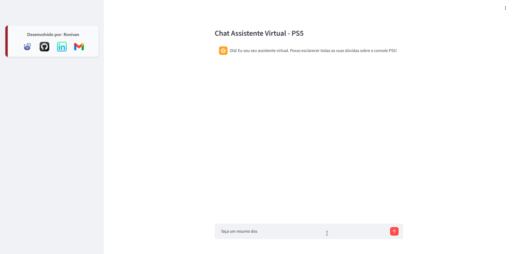
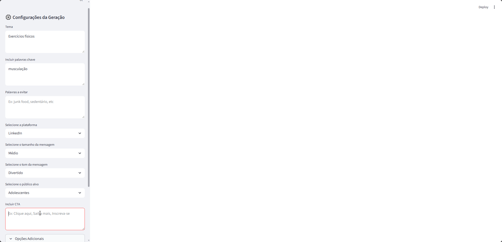
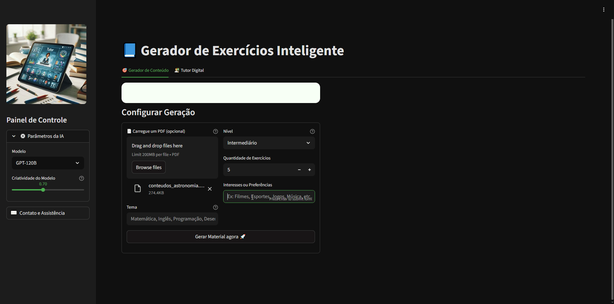

# 🚀 Projetos com LLMs

## 💻 Demo na nuvem (Assistente Financeiro) ->  http://35.188.206.218:8501/

*Este portfólio reúne projetos que utilizam **Modelos de Linguagem (LLMs)** para resolver diferentes problemas de negócio.*  
*O repositório está em constante evolução: novas funções e páginas serão adicionadas gradualmente.*
*Cada arquivo representa uma solução prática para desafios comuns enfrentados por empresas.*
*Os projetos foram desenvolvidos para serem* ***facilmente adaptáveis***
*a diferentes contextos, bastando ajustes simples em lógicas, prompts e dados.*

---

## 📂 Estrutura do Repositório

### [`functions_and_documents`](functions_and_documents)
- *Contém funções auxiliares e documentos adicionais, organizados por projeto para garantir controle e clareza.*

#### [`functions_and_documents/Gerador_de_Conteudo/functions.py`](functions_and_documents/Gerador_de_Conteudo/functions.py)  
> Funções utilizadas no projeto de **geração de conteúdo para SEO**.

#### [`functions_and_documents/ProjetoRAG/functions.py`](functions_and_documents/ProjetoRAG/functions.py)  
> Funções utilizadas no projeto **RAG (Retrieval-Augmented Generation)**.

#### [`functions_and_documents/Gerador_de_exercicios/functions.py`](functions_and_documents/Gerador_de_exercicios/functions.py)
> Funções utilizadas no projeto de **geração de exercícios com RAG.**

#### [`functions_and_documents\Assistente_Fincaneiro\functions.py`](functions_and_documents/Assistente_Fincaneiro/functions.py)
> Funções utilizadas no projeto de **Análise de Documentos Financeiros**

---

### `Projetos disponíveis`
Projetos prontos para execução via arquivos `.py`.

#### 1) [Chatbot - Projeto RAG](01_💬_Projeto_RAG.py)
**Projeto principal – Autoatendimento Personalizado com RAG**  
- Modelo que responde a perguntas e dúvidas de clientes com base em documentos da empresa.  
- Respostas rápidas e contextualizadas a partir de PDFs.  
- Estudo de caso: manual do **PlayStation 5**.  
- [📖 Manual do Console aqui](https://www.playstation.com/content/dam/global_pdc/pt-br/corporate/support/manuals/ps5-docs/2100ab/CFI-21XX_PS5_Instruction_Manual_Web$pt-br.pdf)
+ [Documentação Completa aqui](functions_and_documents/ProjetoRAG/README.md)
  

---

#### 2) [Marketing - Geração de Conteúdo](02_🧲_Gerador_de_Conteudo.py)
**Geração de Conteúdo Dinâmico para Marketing**  
- Criação de conteúdos personalizados para redes sociais (Facebook, LinkedIn, Instagram, etc).  
- Interface simples para engenharia de prompts sem necessidade de conhecimento técnico.  
- Possibilidade de configurar: tópico, público-alvo, tamanho do texto, CTA, emojis e muito mais.  
- Resultado: **conteúdo para aumentar engajamento pronto em segundos.**
+ [Documentação Completa aqui](functions_and_documents/Gerador_de_Conteudo/README.md)

---

#### 3)[Educação - Exercícios e Tutor Digital](03_👨‍🎓_Gerador_de_Exercicios.py)
**Geração de Exercícios para professores**
- Criação de exercícios personalizados para estudantes de diversas áreas.
- Interface pronta para utilização e altamente personalizável com possibilidade de exportações de documentos em DOCX.
- Possibilidade de configurar: nível, matéria, quantidade de exercícios, interesses, etc
- Resultado: **Exercícios personalizados baseados em documentos recuperados através de técnicas RAG.**
+ [Documentação Completa aqui](functions_and_documents/Gerador_de_exercicios/README.md)

---

#### 4)[Finanças - Assistente Financeiro](04_💵_Assistente_Financeiro.py)
**Agente Inteligente - Insights Instantâneos sobre finanças**
- Entrega de recomendações personalizadas com base em necessidades reais da empresa.
- Relatórios e resumos gerados em tempo real com base em documentos da empresa.
- Processamento adaptado para documentos variados, como PDF, CSV e XLSX.
- Gráficos e Insights gerados po agente através de perguntas em linguagem natural.
- Resultado: Gráficos e Insights confiáveis gerados em segundos **SEM UMA LINHA DE CÓDIGO SEQUER**
+ [Documentação completa aqui](functions_and_documents/Assistente_Fincaneiro/README.md)

---

## ✨ Diferenciais
- Projetos modulares e reutilizáveis.  
- Fácil adaptação para diferentes setores e empresas.  
- Documentação clara e organizada.  
- Foco em aplicações reais de LLMs.

---

### ⚙️ Instalação

**Clone o repositório e instale as dependências:**
- git clone https://github.com/Ronizorzan/LLMs-e-Agentes-de-IA.git
- cd Gerador_de_Conteudo
- pip install -e .

▶️ Uso
Execute o projeto com:
streamlit run nome_do_arquivo_principal.py

Acesse no navegador:
http://localhost:8501

Crie um arquivo `.env` na raiz do projeto e adicione sua chave da Groq API, Gemini API, etc:
GROQ_API_KEY=suachaveaqui
GOOGLE_API_KEY=suachaveaqui

## 📌 Status
🔧 Em desenvolvimento contínuo – novas funcionalidades e projetos serão adicionados regularmente.