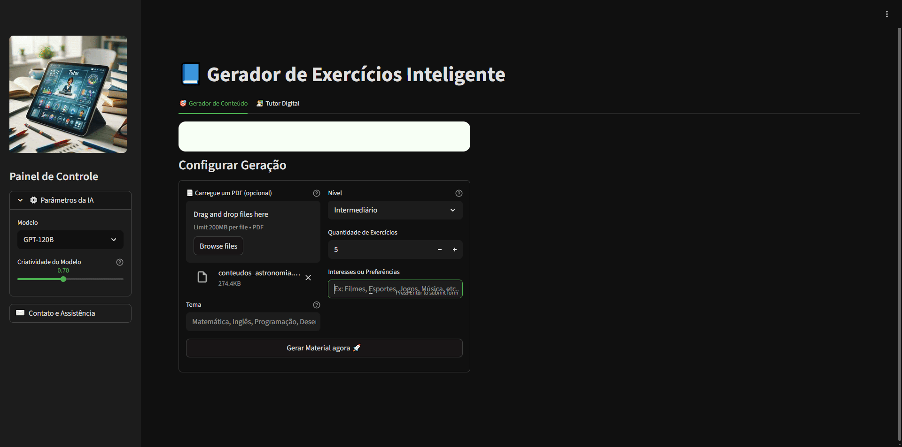

# 🎓 Gerador de Exercícios Inteligente RAG & Tutor Digital

Este projeto é uma aplicação avançada de **EdTech** que utiliza Inteligência Artificial Agêntica para transformar documentos estáticos em experiências de aprendizado dinâmicas e personalizadas.
 A plataforma vai além da geração de texto simples, integrando busca na internet em tempo real e processamento de documentos (RAG) para garantir precisão pedagógica e contextual.
 
 ## 🚀 Funcionalidades Principais
 ### 1). Gerador de Conteúdo Personalizado (RAG)Aprendizado Baseado em Contexto:
 - O sistema permite o upload de arquivos no formato PDF , utilizando-os como base única para a criação de questões, evitando alucinações da IA.
 - **Mix de Interesses:** Possibilidade de cruzar temas técnicos (ex: Matemática) com interesses do aluno (ex: Filmes), aumentando o engajamento.
 - **Suporte Científico:** Renderização completa de fórmulas complexas utilizando LaTeX para disciplinas de exatas.
 - **Exportação:** Download direto das listas de exercícios em formato .docx para uso imediato em sala de aula.
 
 ### 2). Tutor Digital Agêntico - IA Agêntica vs. Tradicional:
  Diferente de modelos estáticos, o tutor opera em um ciclo de percepção, raciocínio e ação, sendo capaz de utilizar ferramentas externas de forma autônoma.
  - **Busca em Tempo Real:** Integração com ferramentas como Tavily e Wikipedia para fornecer dados atualizados, como as tendências do mercado de IA em fevereiro de 2026.
  - **Transparência de Processo:** Interface intuitiva que exibe o "pensamento" do agente e as ferramentas ativadas durante a consulta.
  
  ### 3). 🛠️ Stack Tecnológica
  - **Linguagem:** Python.
  - **Interface:** Streamlit (com customização de temas Dark Mode para mais conforto).
  - **Orquestração de IA:** LangGraph / LangChain (implícito pela estrutura de agentes e grafos).
  - **Modelos Suportados:** GPT-120B, Llama.
  - **Processamento de Texto:** RAG (Retrieval-Augmented Generation) com Docling.
  
  ### 4). ⚙️ Painel de Controle e Parâmetros
  ***O sistema oferece controle total sobre a geração do conteúdo através da barra lateral:***
  - **Seleção de Modelo:** Alternância entre diferentes provedores de LLM conforme a necessidade de processamento.
  - **Nível de Dificuldade:** Opções entre Iniciante, Intermediário e Avançado para adequação ao público-alvo.
  
  ### 5). 📖 Como Funciona Internamente:
  
  ***O projeto utiliza uma arquitetura de Agente de Pesquisa que segue quatro etapas críticas:***
  - **Percepção:** Coleta de dados via API ou documentos carregados pelo usuário.
  - **Raciocínio:** O LLM processa a informação e gera um plano de ação.
  - **Ação:** Execução de comandos através de "tool-use" (chamadas de função).
  - **Feedback:** O resultado da ação é reinserido no ciclo para refinar a resposta final.
  #### 📝 ***Exemplo de Saída Matemática***

  $$\lim_{x \to 2} \frac{x^3 - 8}{x^2 - 4} = 3$$
  
  > + O sistema não apenas fornece o resultado, mas explica detalhadamente o processo de fatoração e substituição.
  > + Este projeto foi desenvolvido com foco em acessibilidade educacional e inovação tecnológica em IA.

  